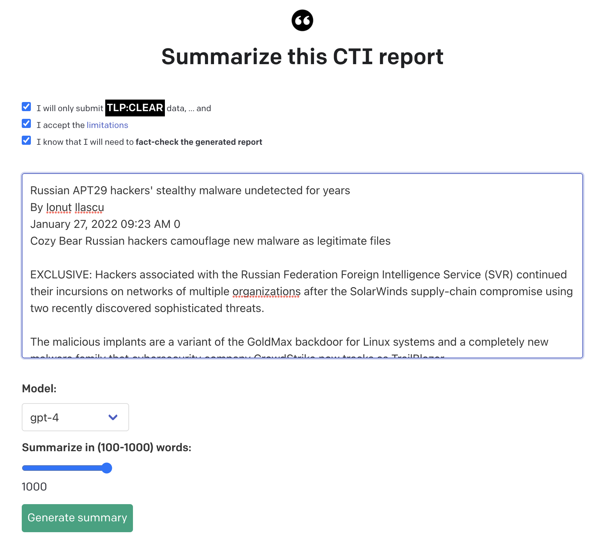
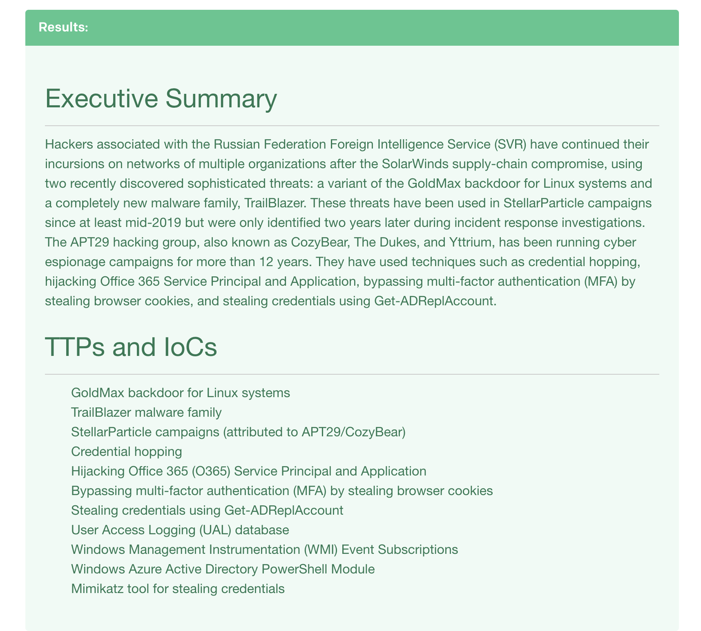

# OpenAI and FastAPI - Text summarization 

This text summarizer is a web based frontend for summarising (Cyber Threat Intelligence]() (CTI) reports. 
It uses OpenAI's GPT-3.5 and GPT-4 API to generate meaningful summaries for management as well as for extracting IP addresses, domains, URLs, hashes etc from a CTI report.

However, if this task is not what you need, you can also give it another system prompt as well. GPT-3.5 and GPT-4 are so flexible.

One of the main benefits of using the API is that, according to OpenAI's documentation, they delete the queries after some time and don't use it for training the next models. See [here](https://platform.openai.com/docs/guides/chat/chat-vs-completions) and [here](https://openai.com/policies/usage-policies).


Input:




Output:




This code is losely based on [Oikosohn's](https://github.com/oikosohn/openai-quickstart-fastapi) openai quickstart fastapi repo, which in turn was based on [openai-quickstart-python](https://github.com/openai/openai-quickstart-python).


It uses the OpenAI API [quickstart tutorial](https://beta.openai.com/docs/quickstart) and the [FastAPI](https://fastapi.tiangolo.com/) web framework. 

With prompt engineering, we ask openai's gpt-4 model to summarize a CTI text for upper management.

**Note**: you will have to get your own API key for this.


## Setup

1. First make a copy of the example environment variables file

   ```bash
   # Linux
   $ cp env.example .env
   ```

   ```shell
   # Windows
   xcopy .env.example .env
   ```

2. Add your [API key](https://beta.openai.com/account/api-keys) to the newly created `.env` file
   *Note*: when coding, you might want to not send a request to openai for every page reload. In that case, set `DRY_RUN=1` in `.env`.


3. Then build the image:

```bash
docker build -t openai-summarizer:0.1 . --network=host
```

(The .env file will be copied into the image as well)


4. Run the dockerized app

   ```bash
   $  docker compose up -d
   ```
   

You should now be able to access the app at [http://localhost:9999](http://localhost:9999)! 


## Reference

- [openai/openai-quickstart-python](https://github.com/openai/openai-quickstart-python)
- [Oikosohn's fastapi openai demo](https://github.com/oikosohn/openai-quickstart-fastapi)


# License

This code is released under the [EUPL license 1.2](https://joinup.ec.europa.eu/collection/eupl/eupl-text-eupl-12)
